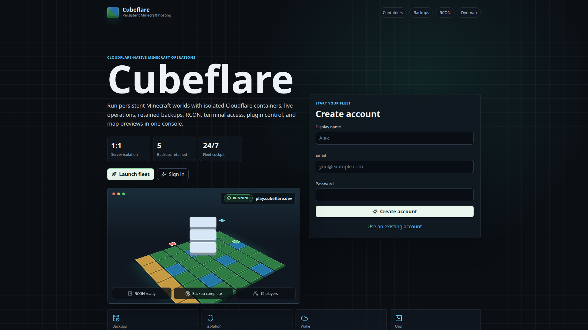
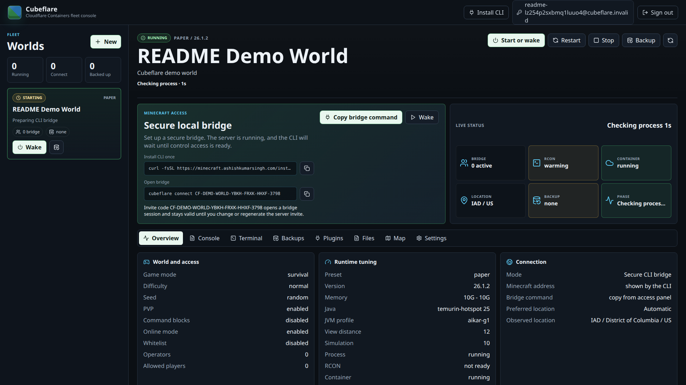

# Cubeflare

<p align="center">
  <strong>Cloudflare-native Minecraft Java hosting with persistent worlds, secure local bridge access, R2 backups, and a fleet console.</strong>
</p>

<p align="center">
  <a href="https://deploy.workers.cloudflare.com/?url=https://github.com/AshishKumar4/Cubeflare">
    
  </a>
</p>

<p align="center">
  <a href="#screenshots">Screenshots</a> ·
  <a href="#features">Features</a> ·
  <a href="#architecture">Architecture</a> ·
  <a href="docs/deployment.md">Deployment guide</a>
</p>

Cubeflare runs a multi-tenant Minecraft hosting control plane on Cloudflare
Workers, Durable Objects, R2, Containers, and the Cloudflare Sandbox SDK. Each
Minecraft world maps to one `MinecraftSandbox` Durable Object and one Sandbox
container runtime, so lifecycle, backup, restore, bridge access, and server
state stay attached to the world instead of a central process.

The platform is built around ephemeral containers. A fresh container restores
the latest backup before launch, active bridge sessions keep the runtime warm,
periodic backups retain world state, and idle worlds naturally sleep.

## Screenshots





## Features

- Account registration, login, sessions, and per-user server ownership through
  SQLite-backed Durable Objects.
- One Minecraft server maps to one `MinecraftSandbox` Durable Object and one
  Sandbox SDK container runtime.
- Presets for Vanilla, Paper, Purpur, Folia, Fabric, and custom launch scripts.
- R2-backed Sandbox SDK backups with retention pruning.
- Server lifecycle controls: create, start or wake, restart, stop, backup,
  restore, and delete.
- Secure CLI bridge for Minecraft Java TCP traffic.
- Owner console for logs, RCON, terminal, files, plugins, backups, settings,
  player activity, and Dynmap mirror status.
- Dynmap mirroring to R2 for supported server and plugin combinations.
- High-fidelity Paper defaults: Java 25, tuned G1 flags, 10G heap profile,
  12 chunk view distance, and 10 chunk simulation distance.

## Deploy

Use the button above to create a Cloudflare deployment from this repository.
After the Worker project is created, finish the account-specific setup in
[docs/deployment.md](docs/deployment.md): custom domain, R2 buckets, Worker
secrets, and the Sandbox SDK R2 credentials used for direct container-to-R2
backup transfer.

Manual deploy:

```sh
corepack enable
yarn install
cp .dev.vars.example .dev.vars
yarn release:check
yarn deploy
```

## Architecture

```text
Browser / Cubeflare CLI
    |
    v
Cloudflare Worker + Hono + Static Assets
    |
    +-- IdentityRegistryDO: email registry, CLI auth, invite code registry
    +-- UserDO: profile, sessions, server summaries
    +-- MinecraftSandbox DO: one Minecraft world and one Sandbox container
            |
            +-- Cloudflare Container: Java server, bridge, Dynmap sync
            +-- R2: backups, plugin uploads, Dynmap mirror
```

Minecraft Java uses TCP, while Workers expose HTTP and WebSocket request
handling. Players run `cubeflare connect`, which opens a local TCP listener and
bridges Minecraft traffic to the server container over an authenticated
WebSocket path. The CLI chooses an available local port and prints the
Minecraft address to join.

## Requirements

- Cloudflare account with Workers, Durable Objects, R2, and Containers enabled.
- A custom domain routed through Cloudflare.
- Node.js 20 or newer.
- Yarn 4 through Corepack.
- Docker for local container image builds during deployment.

## CLI

Install from your deployed Cubeflare origin:

```sh
curl -fsSL https://your-cubeflare-domain.example/install.sh | sh
```

Use an account login:

```sh
cubeflare auth
cubeflare servers
cubeflare connect "Survival world"
```

Or connect with a server invite code:

```sh
cubeflare connect CF-SURVIVAL-WORLD-....
```

Keep the CLI process open while players are connected.

## Development

```sh
yarn dev
yarn typecheck
yarn test:unit
yarn build
```

The project uses Yarn Plug'n'Play. Generated artifacts such as `.pnp.cjs`,
`dist/`, `.wrangler/`, `node_modules/`, and local Sandbox SDK checkouts are not
part of the repository.

## Release Gate

Before publishing a release:

```sh
yarn release:check
```

For production confidence, also run the protocol smoke test against a cleanup
safe deployment:

```sh
BASE=https://your-cubeflare-domain.example yarn e2e:protocol
```

## License

MIT. See [LICENSE](LICENSE).
